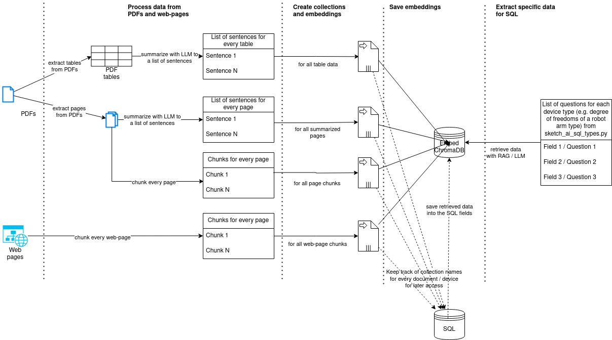

# Sketch-AI

## About

Sketch-AI is a RAG and ReAct based advisor designed for hardware selection in robotics and automation projects, but it can also be adapted to other domains. It utilizes LlamaIndex for orchestration and ChromaDB for embeddings. The model has been tested on OpenAI's GPT-3.5/GPT-4 and locally with the Mixtral 8x7B model. Summarization works well with GPT-3.5 and Mixtral 8x7B. However, for ReAct, GPT-4 provides the best performance.

## Usage

There are 2 files available for working with the data:

1. `load_data.py`: This file is used to load the data.
2. `chat_with_data.py`: This file is used to chat with the loaded data.

Please refer to the respective files for more information on how to use them.

### Load Data

Loading happens with `load_data.py` that processes unstructured data, such as PDFs and websites. It takes as input a JSON file with the links to PDFs, websites, and some additional information, as well as the LLM model provider to use. For example:

```sh 
$ python3 load_data.py -l "openai" -j docs/MOTOR_DRIVE/maxon/IDX_56_M/hw.json
```

The loading process can be summarized with this diagram:




### Chat with Data

With `chat_with_data.py` it possible to talk to loaded data 


## Development Setup

In order to set up the pre-commit hooks, install [pre-commit](https://pre-commit.com/) and then execute the command below in the root directory of the repository:

```sh
pre-commit install
```

## Docker Guide

### Step 1: Export your OpenAI API Key

To retrieve sketch drawings based on your description, export your OpenAI API key by following these steps:

1. Go to the base directory of your project repository.
2. Create a new file `.env`.
3. Enter your OpenAI and Azure API keys in the new `.env` file as shown: \
    `OPENAI_API_KEY=sk-your-key` \
    `AZURE_OPENAI_KEY=your-key` \
    `AZURE_OPENAI_GPT4_KEY=your-key`

### Step 2: Prepare databases

#### ChromaDB

Ensure there is a database folder `db/chroma_db`.

In order to make it work with Azure - "File Share", you have to prepare the chroma.sqlite3 with the following command before uploading it to Azure.

```sh
sqlite3 db/chroma_db 'PRAGMA journal_mode=wal;'
```

For more information, see:

* https://github.com/sketch-ai-de/sketch-ai/issues/2
* https://stackoverflow.com/a/66567897/6018272

#### Postgresql

For now, we hard code the login credentials to connect to our Azure Database for PostgreSQL flexible server.

### Step 3: Build the docker image

```sh
docker build -t sketch-ai .
```

### Step 3: Run the sketch-ai with docker

#### Quick Start

* Start chatbot

```sh
./run.sh
```

* Ask one question from terminal with default LLM (GPT-4, Azure)

```sh
./run.sh chat_with_data.py -p "How many axes does the robot Franka Emika production have?"
```

* Ask one question from terminal with local LLM

```sh
# On macOS
./run.sh chat_with_data.py -l local -m local --local-llm-address host.docker.internal --local-llm-port 8080 -p "How many axes does the robot Franka Emika production have?"

# On linux
./run.sh chat_with_data.py -l local -m local --local-llm-address localhost --local-llm-port 8080 -p "How many axes does the robot Franka Emika production have?"
```

* Run an arbitrary python script in the docker container

```sh
# Run an example script (This works only on macOS. To make it work on linux, you need to change the host.docker.internal to localhost.)
./run.sh examples/open_ai_like.py
```

#### Manual

```sh
# Start docker container
docker run --network host --name sketch-ai-container -ti sketch-ai
```

### Step 4 [Optional]: Upload to AWS

```sh
# Check current container id, e.g. 29cff4a364d4
docker ps -a

# Commit the changes to new image
docker commit 29cff4a364d4 sketch-ai-filled

# Push new changes to AWS container
aws lightsail push-container-image --region eu-central-1 --service-name sketch-ai-aws-container --label sketch-ai-gradio --image sketch-ai-filled:latest

# Update deployment on AWS to use new image
```


## Manual Installation Guide

### Step 1: Export your OpenAI API Key

To retrieve sketch drawings based on your description, export your OpenAI API key by following these steps:

1. Go to the base directory of your project repository.
2. Create a new file `.env`.
3. Enter your OpenAI API key in the new `.env` file as shown: `OPENAI_API_KEY=sk-your-key`

### Step 2: Establish a Virtual Environment

There are two commonly used options for setting up a virtual environment - Conda and venv. These help to avoid potential conflicts between global Python environment and project-level dependencies.

#### Option 1: Creating a Virtual Environment using Conda [RECOMMENDED]

To use Conda for establishing your virtual environment, follow these steps:

1. Download Miniconda installer [here](https://docs.conda.io/projects/miniconda/en/latest/index.html) and run it to install Conda.

2. After successful installation, open a terminal and run the following commands:

    ```bash
    # Creates a new Conda virtual environment named openai-env
    conda create -n openai-env python=3.10

    # Activates the Conda virtual environment named openai-env
    conda activate openai-env
    ```

#### Option 2: Creating a Virtual Environment using venv

If you prefer using venv, follow these steps:

Open a terminal and execute the given commands to set up a virtual environment using Python3 venv:

```bash
# Installs the 'venv' module and sqlite
sudo apt install python3.10-venv sqlite

# Navigate to your project's root directory
cd sketch-ai

# Creates a new venv named openai-env
python3 -m venv openai-env

# Activates the venv named openai-env
source openai-env/bin/activate
```

### Step 3: Installing the Project Dependencies

The project relies on certain Python packages that are listed in the file `requirements.txt`.

Activate your virtual environment and install these packages using pip by executing the following commands:

```bash
cd sketch-ai
pip install -r requirements.txt
```

After executing these commands, your project setup is complete.

## Usage Guide

### Chat with data

Once the setup is complete, you can start using the project.

Try out `chat_with_data.py` with parallel ReAct (custom implementation):

```bash
python3 chat_with_data.py
```

or with sequential ReAct (default implementation of llamaindex):

```bash
python3 chat_with_data.py -s
```


Use ```-r ``` to ativate re-ranking.

```bash
python3 chat_with_data.py -r
```


### Load data
To load new data to SQL and vector database use ```load_data.py```:

```bash
python3 load_data.py -j docs/franka/production/hw/hw.json
```

```bash
python3 load_data.py -j docs/ur/ur3e/hw/hw.json
```

Use ```-r ``` to ativate re-ranking.

```bash
python3 load_data.py -j docs/franka/production/sw/sw.json -r
```

#### Use json to load data

To load the data from different sources for a component, create a ```json``` file with minimal information about component.

##### For Hardware

```json
{
    "company_name": "Franka Emika",
    "product_name": "Franka Production 3",
    "document_type": "ROBOT_ARM",
    "pdf_urls": [
        "https://docs.google.com/uc?export=download&id=12-9k2hkZ8scDtjSXbLt8sEjvVP4fYbLE"
    ],
    "web_urls": [
        "https://www.franka.de/production/"
    ],
    "load_pdfs": true,
    "load_urls": true
}
```

##### For Software


```json
{
    "company_name": "Franka Emika",
    "product_name": "Franka Production 3",
    "document_type": "SOFTWARE",
    "pdf_urls": [
        ""
    ],
    "web_urls": [
        "https://frankaemika.github.io/docs/"
    ],
    "load_pdfs": false,
    "load_urls": true
}
```

##### Batch load

```bash
python3 batch_load.py
```


## Useful Links

* [Using langchain for Question Answering on Own Data](https://medium.com/@onkarmishra/using-langchain-for-question-answering-on-own-data-3af0a82789ed)
* [LlamaIndex Webinar: Document Metadata and Local Models for Better, Faster Retrieval](https://youtu.be/njzB6fm0U8g?si=h8EnIgBTsbXatoXS&t=140)
* [A quick guide to the high-level concepts of LlamaIndex](https://gpt-index.readthedocs.io/en/latest/getting_started/concepts.html)
